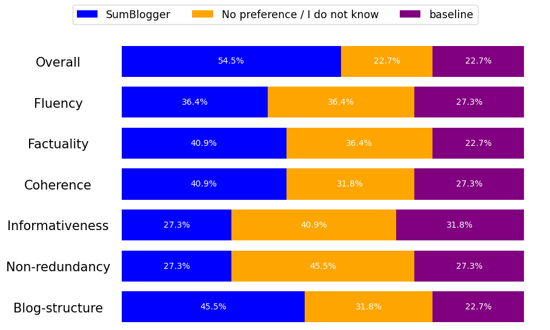

# SumBlogger
SumBlogger is a pipeline for Abstractive Summarization of large collections of scientific documents. 
Specifically, it receives a Vos Viewer network as input, which contains a large collection of scientific documents (e.g. an AI conference) which have been already clustered.
It produces a blogpost summarizing the whole collection or conference.

## Pipeline
- Graph-based clustering: [VosViewer](https://www.vosviewer.com/) implementation of Leiden algorithm, as provided by [Zeta Alpha](https://search.zeta-alpha.com/)
- Summarization pipeline:
    - Selection of representative documents: `src/handlers/vos_representative_docs.py`
    - Single-Doc Summarizer (SDS): Prompting LLM with the `tldr` prompt variant of the `single_doc_summary` usecase as configured in `src/services/text_completion/configuration/single_doc_summary.json`.
    - Multi-Doc Summarizer (MDS): 
        - Intro paragraph: Prompting LLM with the `oneshot_intro_paragraph` prompt variant of the `multi_doc_summary` usecase as configured in `src/services/text_completion/configuration/multi_doc_summary.json`.
        - Main cluster summary with citations: Prompting LLM with the `oneshot_detailed_paragraph` prompt variant of the `multi_doc_summary` usecase as configured in `src/services/text_completion/configuration/multi_doc_summary.json`.
- Blogpost creator:
    - Cluster titles generation: Prompting LLM with the `title_per_intro_summary` prompt variant of the `titles_generation` usecase as configured in `src/services/text_completion/configuration/title_generation.json`.
    - Blogpost surroundings (title, intro, conclusion): Prompting LLM with the `title_intro_conclusion` prompt variant of the `blog_surroundings` usecase as configured in `src/services/text_completion/configuration/blog_surroundings.json`.

## Generate blogpost
Follow the steps below in order to generate a blogpost for a collection of scientific articles.

1. Install package independencies:
    ~~~
    make install-prod
    ~~~
1. Copy the `dev.env.sample` to a `dev.env` file:
    ~~~
    cp dev.env.sample dev.env
    ~~~
1. Replace the `<<OPENAI_API_KEY>` and `<OPENAI_ORG>` placeholders with your configuration from your openai account.
1. Prepare the VosViewer JSON containing the collection of clustered documents:
    - Go to [Zeta Alpha plarform](https://search.zeta-alpha.com/)
    - Create your filters to target a specific collection, such as a conference. For example, you can select `ICLR` from the `Sources` filter, and `2022-2023` from the `Date` filter.
    - On the right side you can see the VosViewer visualization of the top documents. Click on `Explore more` to include more documents. Then maximize the VosViewer window and click on the `Save` button at the top right to download the VosViewer JSON.
1. Go to `tools/vos_blogpost/generate_vos.py` and fill in the corresponding conference info.
1. Replace the placeholders in the following command, and execute it:
    ~~~
    PYTHONPATH='src' python -m tools.vos_blogpost.generate_all --input_file <path-to-vos-viewer-json> --output_dir <output_dir>

    # example:
    PYTHONPATH='src' python -m tools.vos_blogpost.generate_all --input_file tools/vos_blogpost/ICLR/ICLR_2023.json --output_dir tools/vos_blogpost/ICLR/blog
    ~~~
    Keep in mind that if the collection is large, the execution may take several minutes due to the RateLimit applied by open ai. The pipeline is configured to retry with exponential backoff, and it quits retrying if 300 seconds have passed. Check `src/services/text_completion/service_template.py` for more details about the retrying mechanism which is based on the `backoff` package.
1. Open the HTML stored in `tools/vos_blogpost/output/<output_dir>` folder.

Note: The vos viewer visualizations of each cluster are stored in the same output directory, but they will not be visible at the HTML page, because they have to be hosted in a public endpoint in order for the VosViewer iframe to load them in the HTML page.

## Prompts

### Single-Doc Summarization (SDS), SciTLDR
- `vanilla` prompt:
        ~~~
        {{document}}
        Summarize the above article in 1 sentence."
        ~~~
- our `0-shot` prompt:
    - system message:
        ~~~
        You are the most famous research journalist in writing summaries of scientific articles. Your summaries are not only concise, informative and of high quality but they are also very appealing and pleasant to read. You are also an expert in grammar and vocabulary and you can adapt your writing style following the given instructions.
        ~~~
    - user message:
        ~~~
        Write a short and concise phrase summarizing the provided document in {{ number_of_words }} words. The summary should be informative for a reader who is an experienced researcher in this field.
        
        Document:
        {{ document }}
        ~~~
- our `2-shot` prompt:
    The same as the `0-shot`, including two user-bot message pairs at the beginning of the conversation, where each user message contains a document from the training set, and the corresponding bot message contains its gold summary.

### Multi-Doc Summarization (MDS), Multi-XScience
-  `one-step summarization` prompt:
    - system message:
        ~~~
        You are the most famous researcher in writing the related work section of a given scientific article. Your summaries are concise, informative and of high quality.
        ~~~
    - user message:
        ~~~
        You are the author of a scientific article. You have already written the abstract of the article, and you are currently writing the related work section of the article.
        You want to write a paragraph of at most {{ number_of_words }} words, which will be used without modification as a paragraph in the related work section that refers to the referenced documents, either to base on their ideas or to challenge them.
        Be fluent. Avoid repetitive information.
        Refer to the referenced documents of the list using their $id in this format \"@cite_$id\". All documents should be cited. You are encouraged to cite more than one documents in one place if you are sure that the citation is supported by their abstracts.
        
        Scientific Article abstract:
        {{ main_document }}
        
        Referenced documents abstracts:
        
        [{{ ref_document_ids[i] }}]:{{ ref_documents[i] }}
        
        ~~~
-  `two-step summarization` prompt:
    - system message:
        ~~~
        You are the most famous researcher in writing the related work section of a given scientific article. Your summaries are concise, informative and of high quality.
        ~~~
    - user message:
        ~~~
        You are the author of a scientific article. You have already written the abstract of the article, and you are currently writing the related work section of the article.
        You want to write a paragraph of at most {{ number_of_words }} words, which will be used without modification as a paragraph in the related work section that refers to the referenced documents, either to base on their ideas or to challenge them.
        Be fluent. Avoid repetitive information.
        Refer to the referenced documents of the list using their $id in this format \"@cite_$id\". All documents should be cited. You are encouraged to cite more than one documents in one place if you are sure that the citation is supported by their short summaries.
        
        Scientific Article abstract:
        {{ main_document }}
        
        Referenced documents summaries:
         
        [{{ ref_document_ids[i] }}]:{{ ref_documents[i] }}
        
        ~~~

### Blogpost: cluster's intro paragraph
The following templates were used in a 1-shot setting, where a user-bot message pair was used at the beginning of the conversation as the 1-shot example.

- system message template:
    ~~~
    You are the most famous research journalist in writing summaries of scientific articles. Your summaries are not only concise, informative and of high quality but they are also very appealing and pleasant to read. You are also an expert in grammar and vocabulary and you can adapt your writing style following the given instructions.
    ~~~
- user message template:
    ~~~
    Write a short and concise paragraph (at most {{ number_of_words }} words) that can be used as an informative introductory paragraph the given documents.
    The paragraph should be informative and pleasant for a reader who is an experienced researcher in this field.
    Focus on what the given documents have in common and reveal a potential underlying trend in the field. Do not reference or cite any documents. Rely on the information provided in the documents, but do not use explicitly any text from them.
    Do not mention how many documents are given. Do not mention anything related to the order and the position of the documents in the list.
    
    Documents:
    
    [{{ doc_ids[i] }}]:{{ documents[i] }}
    
    ~~~

### Blogpost: cluster's main paragraph
- system message template:
    ~~~
    You are the most famous research journalist in writing summaries of scientific articles. Your summaries are not only concise, informative and of high quality but they are also very appealing and pleasant to read. You are also an expert in grammar and vocabulary and you can adapt your writing style following the given instructions.
    ~~~
- user message template:
    ~~~
    # Instructions
    Write a short and concise paragraph of at most {{ number_of_words }} words that summarizes the given documents.
    The summary should be informative and pleasant for a reader who is an experienced researcher in this field.
    Refer to the documents using 'd' plus their index in square brackets and cite them wherever needed. All documents should be cited. 
    Ensure that each citation is supported by the information provided in documents.
    It is important to combine two or three citations in single sentences instead of creating one sentence for each cited document.
    Use only information from the given documents.
    Avoid the usage of generic sentences that do not refer to any document.
    Avoid mentioning how many documents are given and what is the position of the documents in the list.
    Avoid using the citation as the subject of any phrase or sentence.
    
    # Documents
    
    [{{ doc_ids[i] }}]:{{ documents[i] }}
    
    ~~~
## Experiments

### Single-Doc Summarization (SDS)
We used the [SciTLDR](https://huggingface.co/datasets/allenai/scitldr) dataset to evaluate the SDS component of SumBlogger.
The results table can be found below:
| experiment_name  | rouge1_stopwords | rouge2_stopwords | rougeL_stopwords | bleu             | bert_score       |
|------------------|------------------|------------------|------------------|------------------|------------------|
| scitldr_catts    | 0.416            | 0.212            | 0.359            | 0.027            | 0.697            |
| scitldr_pegasus  | 0.399            | 0.208            | 0.346            | 0.126            | 0.692            |
| scitldr_t5       | 0.403            | 0.208            | 0.351            | 0.143            | 0.696            |
| scitldr_vanilla  | 0.409            | 0.199            | 0.339            | 0.113            | 0.699            |
| scitldr_zero_shot| 0.416            | 0.200            | 0.345            | 0.114            | 0.700            |
| scitldr_two_shot | 0.445            | 0.223            | 0.375            | 0.144            | 0.708            |

To reproduce the evaluation of the SDS component, follow the below steps:
1. Run the vanilla prompt:
    ~~~
    python -m tools.experimentation.run_instruction_tuned_llm --experiment-name scitldr_vanilla --size <NUMBER_OF_DATASET_ENTRIES> --offset <OFFSET_OF_DATASET_ENTRIES>
    ~~~
    where `<NUMBER_OF_DATASET_ENTRIES>` refers to how many cases you want to execute, and `<OFFSET_OF_DATASET_ENTRIES>` refers to which entry of the dataset you want to start. The reason we use these arguments is to avoid overloading openai with request for the whole dataset at once, because `RateLimitError` is raised. The suggested approach is to generate the summaries in batches of 50-100 summaries.

1. Run our prompt without exemplars, as suggested in the vanilla prompt experiment:
    ~~~
    python -m tools.experimentation.run_instruction_tuned_llm --experiment-name scitldr_zero_shot --size <NUMBER_OF_DATASET_ENTRIES> --offset <OFFSET_OF_DATASET_ENTRIES>
    ~~~

1. Run our 2-shot prompt, as suggested in the vanilla prompt experiment:
    ~~~
    python -m tools.experimentation.run_instruction_tuned_llm --experiment-name scitldr_two_shot --size <NUMBER_OF_DATASET_ENTRIES> --offset <OFFSET_OF_DATASET_ENTRIES>
    ~~~

The above will generate the summaries of each method under `tools/experimentation/results/summaries`.

To evaluate the summaries run the following command:
~~~
python -m tools.experimentation.evaluate_summaries --experiment-names scitldr_vanilla scitldr_zero_shot scitldr_two_shot  --metrics rouge1_stopwords rouge2_stopwords rougeL_stopwords bleu bert_score --results-filename scitldr
~~~

This will generate the `scitdr_results.csv` under `tools/experimentation/results/evaluations`, with the scores of each methods on the following metrics:
ROUGE-1, ROUGE-2, ROUGE-L, BLEU, BERTScore.

#### Significance testing
To check if our results are statistically significant, we perform a paired t-test between our two-shot prompt approach against both the CATTS model and the T5 model, which resulted in metric scores closer to our method.

To reproduce the significance testing, firstly run the below scripts:
~~~
PYTHONPATH='tools' python -m tools.experimentation.scitldr_scores_per_summary --experiment-names scitldr_catts scitldr_two_shot

PYTHONPATH='tools' python -m tools.experimentation.scitldr_scores_per_summary --experiment-names scitldr_t5 scitldr_two_shot
~~~
This will generate the metric values for each pair of summaries between the two compared pairs and will produce the corresponding csv files under  `./tools/experimentation/results/evaluations/` directory.

Then you can run the paired t-test for each metric, using the following scripts:
~~~
PYTHONPATH='tools' python -m tools.experimentation.significance_testing --experiment-names scitldr_catts scitldr_two_shot

PYTHONPATH='tools' python -m tools.experimentation.significance_testing --experiment-names scitldr_t5 scitldr_two_shot
~~~
The above will generate the coresponding txt files under the `./tools/experimentation/results/evaluations/` directory with the p-value results of the t-tests.

### Multi-Doc Summarization (MDS)
We used the [Multi-XScience](https://huggingface.co/datasets/multi_x_science_sum) dataset to evaluate the MDS flow of SumBlogger.
The results table can be found below:
| experiment_name         | rouge1         | rouge2         | rougeL         | bleu           | bert_score     |
|-------------------------|----------------|----------------|----------------|----------------|----------------|
| multi_xscience_onestep  | 0.347          | 0.080          | 0.170          | 0.070          | 0.598          |
| multi_xscience_twostep  | 0.353          | 0.084          | 0.172          | 0.092          | 0.605          |

To reproduce the evaluation of the MDS flow, follow the below steps:
1. Run the one-step MDS approach, where the full abstracts are given directly as input to the MDS component.
    ~~~
    python -m tools.experimentation.run_instruction_tuned_llm --experiment-name multi_xscience_onestep --size <NUMBER_OF_DATASET_ENTRIES> --offset <OFFSET_OF_DATASET_ENTRIES>
    ~~~
    where `<NUMBER_OF_DATASET_ENTRIES>` refers to how many cases you want to execute, and `<OFFSET_OF_DATASET_ENTRIES>` refers to which entry of the dataset you want to start. The reason we use these arguments is to avoid overloading openai with request for the whole dataset at once, because `RateLimitError` is raised. The suggested approach is to generate the summaries in batches of 50-100 summaries.

1. Run the two-step MDS approach, where the summaries of the SDS component are given as input to the MDS component. Use the same guidelines as suggested in the one-step approach evaluation.
    ~~~
    python -m tools.experimentation.run_instruction_tuned_llm --experiment-name multi_xscience_twostep --size <NUMBER_OF_DATASET_ENTRIES> --offset <OFFSET_OF_DATASET_ENTRIES>
    ~~~

The above will generate the summaries of each method under `tools/experimentation/results/summaries`.

To evaluate the summaries run the following script:
~~~
python -m tools.experimentation.evaluate_summaries --experiment-names multi_xscience_onestep multi_xscience_twostep  --metrics rouge1 rouge2 rougeL bleu bert_score --results-filename multi_xscience
~~~

This will generate the `multi_xscience_results.csv` under `tools/experimentation/results/evaluations`, with the scores of each methods on the following metrics:
ROUGE-1, ROUGE-2, ROUGE-L, BLEU, BERTScore.

#### Significance testing
To check if our results are statistically significant, we perform a paired t-test between the one-step
and the two-step approaches in order to validate that the two-step approach leads to a performance gain.

To reproduce the significance testing, firstly run the below script:
~~~
PYTHONPATH='tools' python -m tools.experimentation.scores_per_summary --experiment-names multi_xscience_onestep multi_xscience_twostep
~~~
This will generate the metric values for each pair of summaries between the two methods and will produce the `./tools/experimentation/results/evaluations/multi_xscience_onestep_vs_multi_xscience_twostep.csv`.

Secondly you can run the paired t-test for each metric, using the following script:
~~~
PYTHONPATH='tools' python -m tools.experimentation.significance_testing --experiment-names multi_xscience_onestep multi_xscience_twostep
~~~
The above will generate the `./tools/experimentation/results/evaluations/multi_xscience_onestep_vs_multi_xscience_twostep.txt` file with the p-value results of the t-tests.

### Cited Documents experiment
We also evaluate the ability of the LLM to select representative documents on its own.
Specifically, we select a cluster of 100 documents, we generate their summaries and then we perform 500 different petrubations of the papers. Then we ask the MDS component to generate a cluster summary, citing the 10 most representative papers. We record the number of times that each paper is selected, along with the number of times each index/position of the provided list of papers is selected.

This experiment can be found in `tools/analysis/cited_documents_analysis.ipynb`

#### Results

## User Survey
We also conducted a small user survey, where we presented to the users two pairs of blogposts about the ICLR 2023 conference, and we asked for their preference and feedback.
The two pairs are the following:
- SumBlogger vs a human-written blogpost
- SumBlogger vs a baseline variant of the pipeline where no representative documents are selected

The analysis of the survey results can be found under `tools/analysis/survey_analysis.ipynb`

### Results

